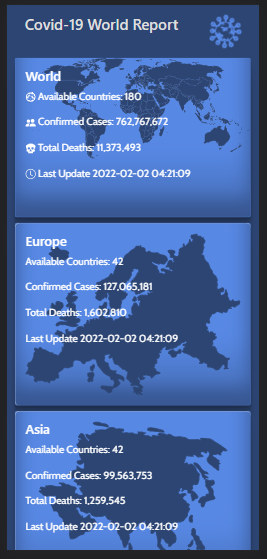
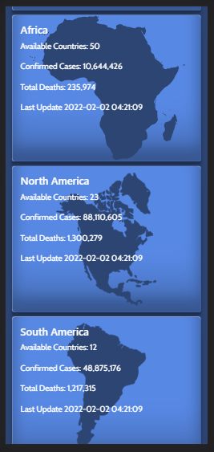
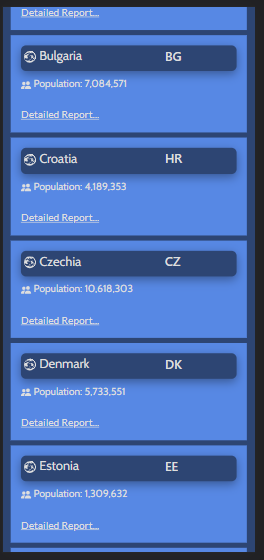
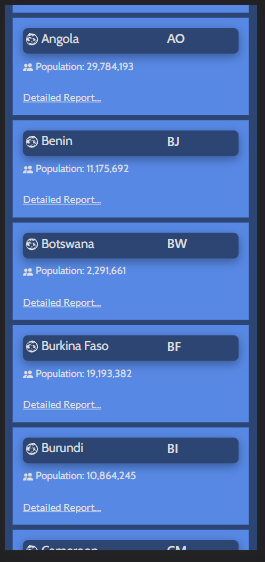
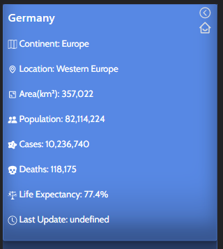
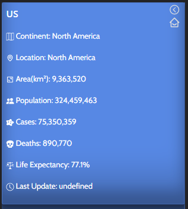

# React & Redux capstone project - Covid-19 World Report

In this project, I did work with the real live data API. My task was to build a web application  that provides statistical informations. 
The application will allow users to check daily reports about Covid-19 all around the world. The users can get many information by Continents -> Countries and specific Country.
### ScreenShoot - Home



### ScreenShoot - Countries by continent



### ScreenShoot - Individual Country



## Built With

- HTML
- CSS 
- JavaScript ES6
- Bootstrap 5
- React
- Redux
- Jest
- Framer Motion

## Live Demo

[Live Demo](https://covidwr.netlify.app/)

## Getting Started

To get a local copy up and running follow these simple example steps.

### Prerequisites

- Text Editor (VSCode is recommended but anyone would do)
- Node
- Web browser (Google chrome recommended)

### Development (Running locally)

- git clone the project

```bash 
git clone git@github.com:Ewoskyx/CovidWR.git

cd CovidWR
```

- Install dependencies

```bash
npm i 
or
npm install
```
- To Start the development server
```bash
npm start
```

- To test the project
```bash
npm run test
```

## Author

👤 **Evren Ersoy**

- [LinkedIn](https://www.linkedin.com/in/ewoskyx/)
- [GitHub](https://github.com/Ewoskyx)
- [Twitter](https://twitter.com/Ewoskyx)

## 🤝 Contributing

Contributions, issues and feature requests are welcome!

Please feel free to check the [issues page](https://github.com/Ewoskyx/CovidWR/issues).

## Show your support

Give a ⭐️ if you like this project!

## Acknowledgments
Creator of the API: M-Media-Group [visit](https://mmediagroup.fr/covid-19)<br>
Design inspired by Nelson Sakwa [visit](https://www.behance.net/sakwadesignstudio)


## 📝 License

[MIT licensed](https://github.com/Ewoskyx/CovidWR/blob/dev/LICENSE).